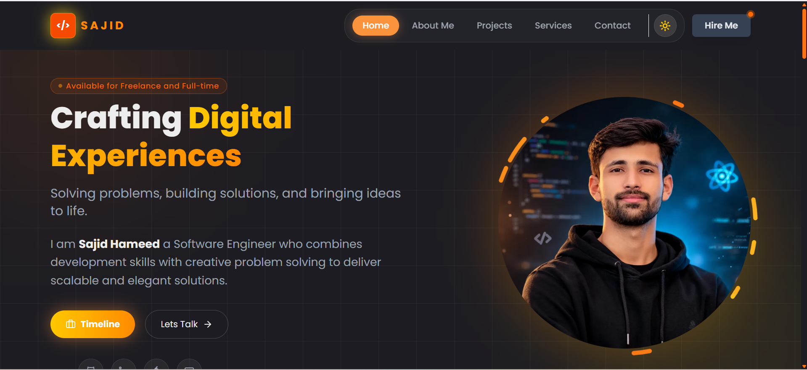

# Sajid Hameed - Professional Portfolio (https://sajidhameedportfolio.vercel.app/)

Welcome to my portfolio! This is a modern, responsive, and high-performance software engineering portfolio built to showcase my skills, projects, and professional journey.

 *(Note: Add a preview screenshot in the public folder)*

## 🚀 Technologies Used

This project leverages the latest web technologies to deliver a seamless user experience:

- **Framework**: [Next.js](https://nextjs.org/) (App Router) - For server-side rendering and optimized performance.
- **Styling**: [Tailwind CSS 4](https://tailwindcss.com/) - Using the latest version for modern, utility-first styling.
- **Fonts**: [Poppins](https://fonts.google.com/specimen/Poppins) & [JetBrains Mono](https://fonts.google.com/specimen/JetBrains+Mono) - Optimized for readability and aesthetics.
- **Language**: [TypeScript](https://www.typescriptlang.org/) - Ensuring type safety and better developer experience.
- **Animations**: [Framer Motion](https://www.framer.com/motion/) - For smooth transitions and interactive micro-animations.
- **Icons**: [Lucide React](https://lucide.dev/) - A beautiful and consistent icon set.
- **Notifications**: [Sonner](https://sonner.steventey.com/) - Clean and sleek toast notifications.
- **Theming**: [Next Themes](https://github.com/pacocoursey/next-themes) - Supporting Dark and Light modes effortlessly.
- **Package Manager**: [pnpm](https://pnpm.io/) - Fast and disk-efficient package management.

## ✨ Key Features

- **Responsive Design**: Fully optimized for mobile, tablet, and desktop screens.
- **Dark/Light Mode**: Seamlessly switch between themes with a dedicated toggle.
- **Dynamic Project Showcase**: A detailed view of my professional projects and case studies.
- **Experience Timeline**: A visual journey of my professional background and education.
- **Services & Skills**: Comprehensive overview of my tech stack and professional services.
- **Interactive FAQ**: A user-friendly workflow and FAQ section.
- **Global Loader**: Custom loading states for a polished feeling.
- **SEO Optimized**: Built with performance and search engines in mind.

## 🛠️ Project Structure

```text
├── app/               # Next.js App Router pages and layouts
├── components/        # Reusable UI components (Hero, Navbar, Footer, etc.)
├── data/              # Static data for projects, services, etc.
├── public/            # Static assets (images, icons)
├── tsconfig.json      # TypeScript configuration
└── package.json       # Project dependencies and scripts
```

## ⚙️ Getting Started

### Prerequisites

- Node.js (Latest)
- pnpm (`npm install -g pnpm`)

### Installation

1. **Clone the repository:**
   ```bash
   git clone https://github.com/SajidHameed223/sajid_hameed_portfolio.git
   ```

2. **Install dependencies:**
   ```bash
   pnpm install
   ```

3. **Run the development server:**
   ```bash
   pnpm dev
   ```

4. **Build for production:**
   ```bash
   pnpm build
   ```

## 📄 License

This project is open-source and available under the [MIT License](LICENSE).

---

Built with ❤️ by [Sajid Hameed](https://github.com/SajidHameed223)
